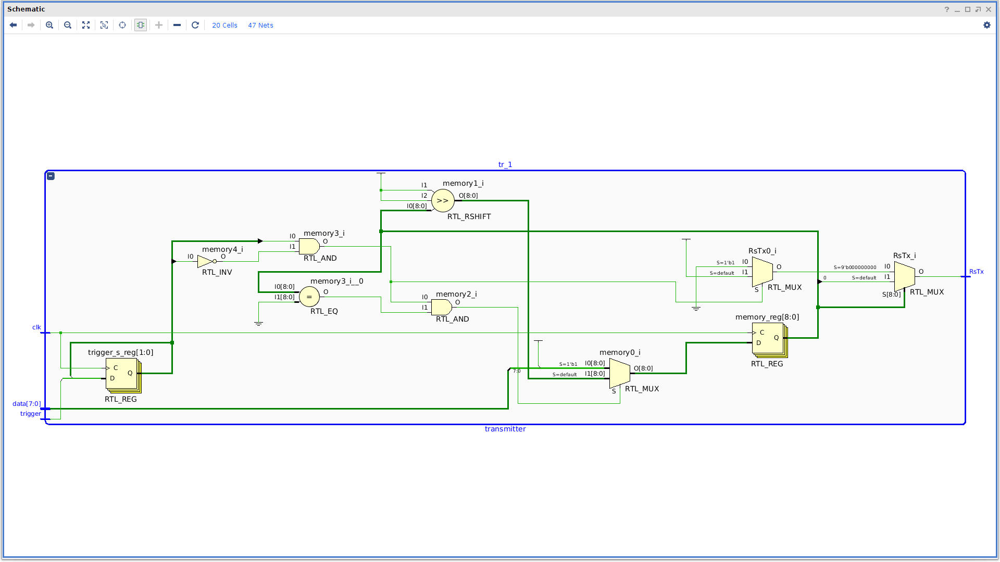

# Basys3Uart
Two Verilog modules, which can use the UART port from the Basys 3 board to transmit and recive bytes with the 8-N-2 configuration.

## Schematics

### Transmitter module

### Reciver module

WIP

## Usage

WIP
